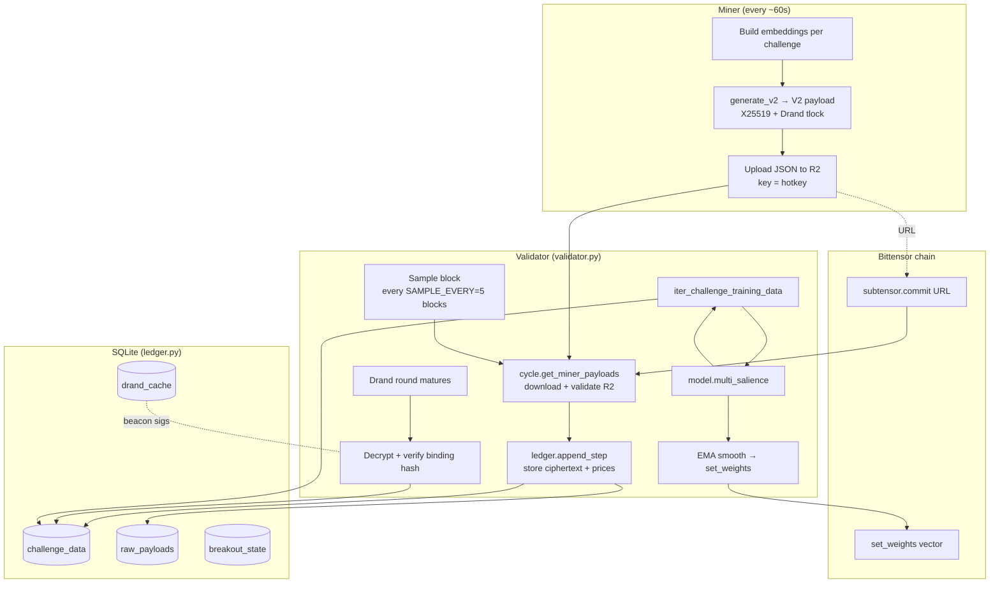

# 01 — Architecture: how MANTIS actually runs

This document gives you the **big picture** of the MANTIS validator/miner system. Every challenge doc in this folder assumes you understand the flow described here.

---

## 1. The actors

| Actor | Job |
|---|---|
| **Miner** | Produces embeddings for each challenge every ~60 s, encrypts them (X25519 owner wrap + Drand time‑lock), uploads to its Cloudflare R2 bucket, and commits the public URL on‑chain. |
| **Validator** | Reads each miner’s commit URL, downloads the ciphertext, waits for the Drand round to mature, decrypts, stores in SQLite, then periodically scores miners and pushes weights back on‑chain. |
| **Drand beacon** | External randomness/timelock service. After round \(r\) is published, anyone can derive the decryption key for ciphertexts locked to round \(r\). |
| **Subtensor / Bittensor chain** | Stores commits (`subtensor.commit()`) and receives the validator’s weight vector (`set_weights()`). TAO emissions follow weights. |
| **Price service** | External process that publishes `latest_prices.json` to R2 for spot prices, and periodically ingests funding rates. Validators consume these to build labels. |

---

## 2. End‑to‑end flow

---

## 3. The validator loop (in words)

Every ~12 s (one block) the validator:

1. Decides whether it is a **sample block** (`block_num % SAMPLE_EVERY == 0`, i.e. every ~60 s).
2. If sampling:
   - `cycle.get_miner_payloads()` — fetches every miner’s latest committed R2 file, validates size/host/key, and stores the ciphertext into `raw_payloads`.
   - `ledger.append_step()` — records current prices for every challenge ticker at this `sidx` (sample index).
3. Any `raw_payloads` whose Drand round has now matured get decrypted using the cached beacon signature. The decrypted 16‑bit float embeddings are written to `challenge_data` keyed by `(ticker, sidx)`.
4. Periodically (every `WEIGHT_CALC_INTERVAL = 1000` blocks):
   - Stream training data **one challenge at a time** via `ledger.iter_challenge_training_data()`.
   - `model.multi_salience()` dispatches each challenge to its scorer in `bucket_forecast.py`, `hitfirst.py`, `range_breakout.py`, `xsec_rank.py`, or `funding_xsec.py`.
   - Salience vectors are normalized per challenge, weighted by `challenge.weight`, and averaged.
5. Every `WEIGHT_SET_INTERVAL = 360` blocks, the latest aggregated vector is **EMA‑smoothed** with α = 0.15 and pushed on‑chain via `set_weights()`. 30% of emissions are burned to UID 0 (`BURN_PCT = 0.30`).

See `validator.py` for the actual loop and `ledger.py` for all storage logic.

---

## 4. Storage layout (SQLite, WAL mode)

| Table | Key | Payload |
|---|---|---|
| `challenge_data` | `(ticker, sidx)` | `price` (float) or `price_data` (JSON, multi‑asset), `hotkeys` (JSON list), `embeddings` (binary float16 blob) |
| `challenge_meta` | `(ticker)` | `dim`, `blocks_ahead` |
| `block_index` / `blocks` | sequential index | block number |
| `raw_payloads` | hotkey + round | encrypted ciphertext held until maturation |
| `drand_cache` | round | beacon signature |
| `breakout_state` | asset | serialized range tracker state |

Training data for scoring is iterated per challenge — the validator never loads all challenges into RAM at once.

---

## 5. Payload format (V2)

Miners emit a JSON file with these fields:

| Field | Meaning |
|---|---|
| `v` | version (2) |
| `round` | Drand round at which the tlock unlocks |
| `hk` | miner hotkey (must match the commit) |
| `owner_pk` | owner X25519 public key |
| `C` | ciphertext |
| `W_owner` | X25519 ECDH key wrap for the owner |
| `W_time` | Drand IBE wrap for the validator |
| `binding` | SHA‑256(hk ∥ round ∥ owner_pk ∥ ephemeral_pk) (used as AEAD AAD) |
| `alg` | `"x25519-hkdf-sha256+chacha20poly1305+drand-tlock"` |

**Commit constraints:**
- Host must be `*.r2.dev` or `*.r2.cloudflarestorage.com`.
- Object key must be exactly the hotkey (no path segments).
- Size ≤ 25 MB.

The **binding hash** prevents replay, relay, and substitution attacks — you cannot copy another miner’s payload and resubmit under your own hotkey.

---

## 6. Scoring pipeline (at a glance)

For *every* challenge the scorer:

1. Builds an input matrix `X` of shape `(T, H * D)` where
   - `T` = number of valid samples,
   - `H` = number of hotkeys currently seen,
   - `D` = challenge `dim`.
2. Builds labels `y` using **future prices or funding rates** at horizon `blocks_ahead`.
3. Applies an **embargo of `LAG`** samples between train end and validation start (to prevent label leakage through the horizon).
4. Fits one or more **L2 logistic regressions** (some challenges add an ElasticNet meta‑model on top).
5. Returns a dict `{hotkey → importance}`, normalized to sum to 1, where importance ≈ \(|\beta_j|\) of the coefficient assigned to that miner.

Differences across challenges are:

- **How labels are built** (direction, barrier hit, bucket, cross‑sectional rank, …).
- **What goes into X** (single column per miner, `D` columns per miner, or `N_assets × D` columns per miner).
- **How features are selected** before the meta‑model (top‑K by AUC, AUC gate, etc.).
- **How importance is aggregated** (\(|\beta_j|\), \(\beta_j^2\) summed across classes, AUC‑scaled, …).

The rest of the guide documents exactly these four things for each challenge.

---

## 7. Weight aggregation

After every challenge has a normalized salience vector \(\hat{s}_{j,c}\):

\[
s_j = \frac{1}{\sum_c w_c} \sum_c w_c \cdot \hat{s}_{j,c}
\]

Then:

- EMA smooth across weight‑set intervals: `ema ← 0.85 * ema + 0.15 * s`.
- Reject degenerate distributions (near‑uniform, zero‑sum).
- Burn `BURN_PCT = 30%` to UID 0.
- Renormalize and push on‑chain.

---

## 8. Security considerations (why the system works)

| Threat | Mitigation |
|---|---|
| Front‑running predictions | Drand time‑lock: validator cannot decrypt before round `r`. |
| Late / edited submissions | Round is committed in the ciphertext; ciphertext is bound to the commit URL. |
| Hotkey spoofing | Binding hash includes hotkey; decryption fails if hotkey mismatches commit. |
| Replay / relay | Binding hash also includes owner_pk and ephemeral_pk. |
| Sybil cloning | L2 regularization in the meta‑model splits coefficient mass across correlated miners; a duplicate gets ≈ `w/n` instead of `w`. |
| Zero‑info / stale miners | Stale filter (`std < 1e-4`) zeros out constant columns; L1 piece of ElasticNet pushes AUC ≈ 0.5 features to zero. |
| Validator manipulation | Walk‑forward + embargo + deterministic seed → reproducible salience. |

---

## 9. Key parameters you should memorize

| Param | Value | Where | Meaning |
|---|---:|---|---|
| `SAMPLE_EVERY` | 5 blocks | `config.py` | Sample cadence (~60 s) |
| `LAG` | 60 samples | `config.py` | Embargo between train and validation |
| `TASK_INTERVAL` | 500 blocks | `config.py` | Task scheduling cadence |
| `WEIGHT_CALC_INTERVAL` | 1000 blocks | `config.py` | How often salience is recomputed |
| `WEIGHT_SET_INTERVAL` | 360 blocks | `config.py` | How often weights are pushed on‑chain |
| `BURN_PCT` | 0.30 (UID 0) | `config.py` | Emission burn |
| `MAX_DAYS` | 60 | `config.py` | History window cap |
| `EMA α` | 0.15 | `validator.py` | Weight smoothing factor |
| `TOP_K` | 20–50 | scorers | Feature‑selection top‑K |

---

Now that you have the architecture in mind, jump to any challenge doc — each tells the same story (*what is predicted, what is submitted, how the label is built, how salience is computed*) but with challenge‑specific details.
