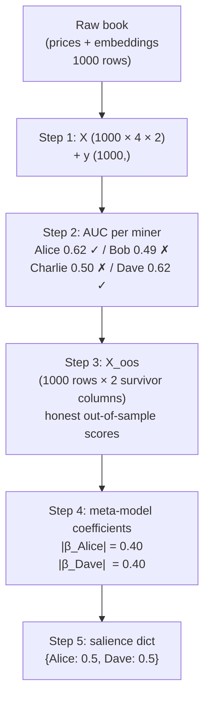
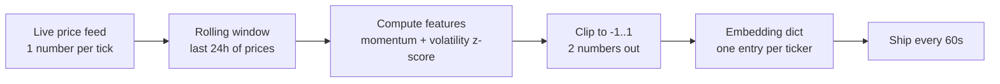

# 02 — Binary Challenges (ETH / CADUSD / NZDUSD / CHFUSD / XAGUSD, 1h)

Five parallel binary‑direction challenges. The simplest and best entry point.

| Property | Value |
|---|---|
| **Tickers** | `ETH`, `CADUSD`, `NZDUSD`, `CHFUSD`, `XAGUSD` |
| **Embedding dim** | `2` (two numbers per sample) |
| **Horizon** | `300` blocks ≈ 1 hour |
| **Weight** (each) | `1.0` |
| **Scorer** | `salience_binary_prediction()` in `model.py` |

---

## 1. What you are predicting

Will the price go **up** over the next 1 hour?

- `y = 1` if the price is higher 300 blocks from now.
- `y = 0` if the price is lower or equal.

---

## 2. What you submit

A **2‑number vector per ticker, every ~60 seconds**. Each number in `[-1, 1]`.

```python
embeddings["ETH"]    = [0.3, -0.1]
embeddings["CADUSD"] = [-0.5, 0.2]
embeddings["NZDUSD"] = [0.0, 0.1]
embeddings["CHFUSD"] = [0.1, 0.1]
embeddings["XAGUSD"] = [-0.2, 0.4]
```

These are **features**, not probabilities. They don't need to sum to anything. The validator feeds them straight into a logistic regression and lets the regression figure out how to combine them.

---

## 3. Where does the embedding come from? (the base source)

The **only raw data you need** is a **time series of recent prices** for the ticker. Nothing else is mandatory.

From that single price stream, you compute **two numbers** that hopefully predict the next 1‑hour direction. Common choices:

| Feature idea | Formula (simple) | What it captures |
|---|---|---|
| Short‑term momentum | `(P_now − P_10min_ago) / P_10min_ago`, clipped to `[-1, 1]` | Recent direction |
| Longer momentum | `(P_now − P_1h_ago) / P_1h_ago` | Hourly trend |
| Volatility regime | z‑score of rolling 1h return std | Calm vs. choppy market |
| Mean reversion | z‑score of `P_now` vs. 4h moving average | Overbought / oversold |

You pick **any two** (or combine several into two), clip to `[-1, 1]`, and ship them as your 2‑number embedding.

That's it. You do not need book data, order flow, news, or anything fancy to start — you can upgrade later.

---

## 4. Simple vocabulary (the only letters you'll see)

| Letter | Meaning | Example |
|---|---|---|
| `T` | How many samples of history the validator has. One sample = 60 s. | `T = 1000` ≈ 17 hours |
| `H` | How many miners are in the pool. | `H = 4` miners |
| `D` | Your embedding size. | `D = 2` for binary |
| `AUC` | "How often does a classifier rank an up‑day higher than a down‑day?" `0.5` = random, `1.0` = perfect. | `AUC = 0.62` means better than random |

That's the whole vocabulary. Everything else will be defined **right where it's used** in the example below.

---

## 5. Validation logic — a worked example, end to end

We'll invent 4 miners and walk through every single data structure the validator builds. At every step I'll say exactly **what the structure is, what shape it has, and where its numbers come from** — no symbols pulled out of thin air.

### Setup — meet the miners

- Ticker: `ETH`. Horizon: 1 hour (= 60 samples, because 1 sample = 60 s).
- Validator has collected `T = 1000` samples of history.
- Four miners submitted an embedding at every sample:

| Miner | Strategy | Their embedding at sample `t` |
|---|---|---|
| **Alice** | Momentum + volatility — a *real* model | `[momentum(t), vol_z(t)]` — varies per sample |
| **Bob**   | Random noise | `[rand(), rand()]` — different every sample |
| **Charlie** | Lazy — always the same | `[0.0, 0.0]` — never changes |
| **Dave** | Sybil — copies Alice | Literally Alice's `[x₁, x₂]` — identical |

### The raw book the validator has collected

Before any math happens, the validator's SQLite database holds these columns for each of the 1000 samples:

| `t` | ETH price at `t` | Alice's embedding | Bob's embedding | Charlie's | Dave's (= Alice) |
|---:|---:|---|---|---|---|
| 0   | 3050.12 | `[ 0.30, -0.10]` | `[ 0.44, -0.87]` | `[0, 0]` | `[ 0.30, -0.10]` |
| 1   | 3051.88 | `[ 0.22,  0.05]` | `[-0.12,  0.61]` | `[0, 0]` | `[ 0.22,  0.05]` |
| 2   | 3050.55 | `[-0.05,  0.12]` | `[ 0.77, -0.34]` | `[0, 0]` | `[-0.05,  0.12]` |
| …   | … | … | … | … | … |
| 999 | 3082.10 | `[ 0.12, -0.22]` | `[-0.66,  0.28]` | `[0, 0]` | `[ 0.12, -0.22]` |

### Deriving the label column `y`

For every sample `t` (where `t + 60` is still in range), the validator computes:

```
return(t) = (price[t + 60] − price[t]) / price[t]
y[t]      = 1  if return(t) > 0  else 0
```

Example: `price[0] = 3050.12`, `price[60] = 3053.88` → return = +0.001 → `y[0] = 1` (up).

After this, `y` is a column of **1000 zeros and ones**. Let's say 540 ones, 460 zeros.

---

### Data structure #1 — the input matrix `X` and label vector `y` *(Step 1)*

The validator reshapes the raw book into one tidy tensor called `X`:

- **`X`**: a 3‑D array of shape `(T=1000, H=4, D=2)`.
  - `X[t, j, :]` = miner `j`'s 2‑number embedding at sample `t`.
  - So `X[5, 0, :]` = Alice's embedding at sample 5.
- **`y`**: a 1‑D array of shape `(1000,)`, full of 0s and 1s as derived above.

Sanity guards (if any fail → scorer returns `{}` and skips):
- `T ≥ 500`? ✓
- Both classes present in `y`? ✓

---

### Data structure #2 — per‑miner AUC scores *(Step 2, feature selection)*

The validator now asks, for each miner separately: *"Can this one miner's 2 numbers predict direction at all?"*

Procedure for each miner `j`:

1. Split the timeline in half: rows `0..499` = **train**, rows `500..999` = **test**.
2. Fit a tiny logistic regression using **only miner j's embedding columns**:
   ```
   score = β₀ + β₁ · x₁ + β₂ · x₂
   ```
   Training finds the three `β`s that best match the train‑half labels.
3. Apply those `β`s to the test half → a score for every test row.
4. Compute **AUC** = fraction of (up‑row, down‑row) pairs where the up‑row's score is higher.

Result:

| Miner | Test‑half AUC | Keep? |
|---|---:|---|
| **Alice**   | **0.62** | ✓ beats 0.5 → survives |
| Bob     | 0.49 | ✗ worse than random → dropped |
| Charlie | 0.50 | ✗ constant, no signal → dropped |
| **Dave**    | **0.62** | ✓ identical to Alice → survives |

**Two miners survive: Alice and Dave.** Everyone else gets `0` salience and is ignored from here on.

> AUC reminder: 0.62 means *"Pick one random up‑day and one random down‑day from the test half; Alice's score is higher on the up‑day 62% of the time."*

---

### Data structure #3 — the OOS score matrix `X_oos` *(Step 3)*

This is the table you asked about. Let me introduce it properly.

**What is `X_oos`?**

`X_oos` is a **brand new matrix** the validator builds in Step 3. It does **not** contain embeddings. It contains **scores** produced by each surviving miner's tiny logistic regression, but produced **honestly** — meaning: the score at row `t` was generated by a mini‑model that was trained only on data from *before* `t − 60`.

Shape of `X_oos`:

- **Rows:** `T = 1000` — one per sample.
- **Columns:** one per **surviving** miner. Here that's 2 columns: Alice's and Dave's.

So `X_oos[t, Alice]` = "an honest score produced for sample `t` using Alice's embedding, from a mini‑model that never saw sample `t` during training."

`X_oos[:, Alice]` is the notation *"take every row, column Alice"* — it's Alice's whole score column (1000 numbers long, some `NaN` for the earliest samples that had no history to train on).

**How each entry of `X_oos` is built — the walk‑forward loop**

The validator chops the timeline into segments. For each segment, it trains Alice's tiny logistic on *everything before the embargo*, and uses that mini‑model to score the segment. With bigger histories the loop runs multiple times; with our `T = 1000` it runs just once:

```
Train Alice's tiny logistic on:  samples   0..939       (940 training rows)
                                                           ^
                                                           |
                         60‑sample embargo (1 hour gap)  — prevents the future-looking label leaking into training
                                                           |
                                                           v
Use that mini‑model to score:    samples 940..999        → write scores into X_oos[940..999, Alice]
```

(In real data `T` is ~86 400 and the validator makes several such segments, each larger than the last; the example uses only one segment for clarity.)

After this loop, `X_oos` looks like:

| `t` | `X_oos[t, Alice]` | `X_oos[t, Dave]` |
|---:|---:|---:|
| 0 …939   | `NaN` | `NaN` |  (not enough history to train on, skipped)
| 940 | 0.11 | 0.11 |
| 941 | -0.35 | -0.35 |
| 942 | 0.62 | 0.62 |
| 943 | 0.08 | 0.08 |
| … | … | … |
| 999 | -0.22 | -0.22 |

Dave's column is **identical** to Alice's because Dave's embeddings were identical — so the tiny logistic fits the same coefficients and produces the same scores.

**Why this matters:** `X_oos` is what feeds Step 4. If the validator just used raw embeddings, a miner with 2 good features could look twice as strong as a miner with 1 equally‑good feature. By converting every miner to a single scalar **score per sample**, all miners are put on the same axis — "one number per miner per sample" — and the meta‑model can compare them fairly.

---

### Data structure #4 — the meta‑model coefficients `β` *(Step 4)*

Now the validator fits **one final** logistic regression, but this time:

- **Features:** the columns of `X_oos` (Alice's column + Dave's column) → a matrix of shape `(60 usable rows, 2 miners)`.
- **Target:** `y[940..999]` — did the price actually go up?
- **Model:** ElasticNet logistic, i.e. logistic regression with a combined L1+L2 penalty.
- **What it learns:** one coefficient `β_j` per surviving miner.

The model written out:

```
prediction(t) = sigmoid(  β₀
                        + β_Alice · X_oos[t, Alice]
                        + β_Dave  · X_oos[t, Dave]  )
```

Each `β_j` answers: *"Given that the other miners' columns are already in the model, how much does miner `j`'s column still shift the answer?"*

Here's the Sybil‑defense demonstration with numbers:

- If Alice had been **alone** (no Dave), the model would have settled on roughly `β_Alice = 0.80`.
- With Dave's column being **a perfect copy**, the L2 penalty says "you're the same thing, so split the credit equally" → `β_Alice = 0.40`, `β_Dave = 0.40`.

| Miner | `|β|` if alone | `|β|` with identical clone |
|---|---:|---:|
| Alice | 0.80 | **0.40** |
| Dave (clone) | — | **0.40** |

Two copies of the same signal earn **together** exactly what one original would have earned. Three copies → 0.27 each. Ten copies → 0.08 each. That is the only reason Sybil cloning does not pay.

(The L1 half of the penalty separately pushes any useless column's coefficient to exactly `0` — so even if Bob had slipped through Step 2, the meta‑model would zero him out.)

---

### Data structure #5 — the final salience dictionary *(Step 5)*

Take absolute values of the meta‑coefficients, normalize so they sum to 1:

```
|β_Alice| = 0.40
|β_Dave|  = 0.40
sum       = 0.80

salience = {
    "Alice": 0.40 / 0.80 = 0.5,
    "Dave" : 0.40 / 0.80 = 0.5,
}
```

Bob, Charlie, and every miner who didn't survive Step 2 → not in this dict → **0**.

This dict is the binary‑challenge salience for ETH. The whole pipeline is then repeated for each of the other 4 tickers (CADUSD, NZDUSD, CHFUSD, XAGUSD); each resulting dict is multiplied by `weight = 1.0`, averaged together, EMA‑smoothed, and pushed on‑chain as final weights.

---

### The five data structures in one picture



That's the **entire** binary scorer. Every other challenge in this repo is a variation of the same 5‑structure pipeline.

---

## 6. What gets you zero weight

| Mistake | What happens |
|---|---|
| Submit constants (like Charlie) | AUC = 0.5 → dropped at Step 2 |
| Submit random noise (like Bob) | AUC ≈ 0.5 → dropped, or `β` crushed to 0 |
| Copy a top miner (like Dave) | Survive Step 2, but share coefficient → earn **half** of what you thought |
| Miss the ticker | No column at all → `0` |
| Submit only sometimes | Few rows → unstable `β` → small salience |

---

## 7. My take — how to build a good miner

Given that validation logic, here is the **minimum** pipeline that actually works. You can add complexity later.

### What you need

1. **A live price feed for each ticker.** Use the same source the validator uses if possible — spot for ETH, FX for the forex/metal pairs.
2. **A small in‑memory rolling window** of the last ~24 hours of prices (more for a 6 h horizon).
3. **A simple model that outputs two numbers every 60 seconds.**

### The simplest working pipeline



### My opinionated advice

- **Start with two *independent* features, not two versions of the same thing.** E.g. short‑term momentum + volatility regime. Submitting `[p, 1-p]` is the worst thing you can do — it's really only *one* number, and wastes half your capacity.
- **Clip your outputs to `[-1, 1]`.** The validator doesn't care about scale but extreme values make your coefficient unstable.
- **Submit every single cycle.** Even if your model hasn't changed, re‑send the previous value. A missing sample just becomes a gap in the validator's view of you.
- **Don't copy other miners.** The L2 split is automatic — you will literally split your reward with them.
- **Match the label.** When you train your own model, use `y = 1 if price goes up over 300 blocks (1 hour)`. Same label as the validator. No surprises.
- **Forget about being fancy until the basics work.** A clean momentum + volatility setup that runs every 60 s and survives feature selection beats a brilliant model that ships late once a day.

### Why that order?

- Features that *actually* predict 1h direction → you pass **Step 2 feature selection** (survive AUC > 0.5).
- Independent features → your per‑miner logistic in **Step 3** can really use both dimensions.
- No clones → your `β` in **Step 4** is not split with anyone else.
- Continuous submission → your OOS column in **Step 3** is dense, not full of gaps.

---

## 8. Where to look in the code

| What | Where |
|---|---|
| Main scorer | `model.py` → `salience_binary_prediction()` |
| Feature‑selection loop | same function, block labeled `# --- Feature selection` |
| Walk‑forward segment builder | `_build_oos_segments()` in `model.py` |
| Per‑miner base logistic | `_fit_base_logistic()` in `model.py` |
| Meta ElasticNet logistic | `_fit_meta_logistic_en()` in `model.py` |
| Challenge definitions | `config.CHALLENGES` entries with `loss_func == "binary"` |
