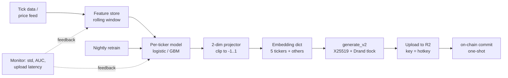

# 02 — Binary Challenges (ETH / CADUSD / NZDUSD / CHFUSD / XAGUSD, 1h)

Five parallel binary‑direction challenges. The simplest and best entry point to understand the MANTIS scoring recipe, because all the more complex challenges are variations of this pattern.

| Property | Value |
|---|---|
| **Tickers** | `ETH`, `CADUSD`, `NZDUSD`, `CHFUSD`, `XAGUSD` |
| **Loss function key** | `binary` |
| **Embedding dim** | `2` |
| **Horizon (`blocks_ahead`)** | `300` blocks ≈ 1 hour |
| **Challenge weight** (each) | `1.0` (5 × 1.0 total) |
| **Scorer** | `salience_binary_prediction()` in `model.py` |

---

## 1. What you are predicting

**Direction of the next 1‑hour return** on that ticker:

\[
y_t = \mathbf{1}\![\, r_{t \to t+H} > 0 \,], \qquad H = 300 \text{ blocks}
\]

A price went up → label `1`. Went down → label `0`. Ties are treated as zero (via `RET_EPS = 0.0`).

Note: `y` must have both classes present in the window, otherwise the scorer returns no salience.

---

## 2. What you submit

A **2‑dimensional vector** per ticker, every sample. Each component must be in \([-1, 1]\).

```python
embeddings["ETH"] = [0.3, -0.1]        # your 2 features
embeddings["CADUSD"] = [-0.5, 0.2]
embeddings["NZDUSD"] = [0.0, 0.0]
embeddings["CHFUSD"] = [0.1, 0.1]
embeddings["XAGUSD"] = [-0.2, 0.4]
```

These are **features**, not probabilities. They are fed straight into a per‑miner L2 logistic regression. They do not need to sum to anything.

---

## 3. Key vocabulary (read this first)

Before the scoring walkthrough, pin down the variables. The code uses these exact letters.

| Symbol | Meaning | Typical value |
|---|---|---|
| `T` | **Number of valid samples** in the training window (rows of `X_flat` / `y`). One sample per `SAMPLE_EVERY = 5` blocks ≈ 60 s. | e.g. at 60 days × 1440 samples/day = **86 400**; minimum **500** to run |
| `H` | **Number of hotkeys (miners)** seen in the window | up to `NUM_UIDS = 256` |
| `D` | **Embedding dim** for the challenge | `2` for binary |
| `H_steps` | **Horizon in samples** (`round(blocks_ahead / SAMPLE_EVERY)`) | `300/5 = 60` |
| `LAG` | **Embargo in samples** between the end of training and the start of validation. Prevents the forward‑looking label from leaking into training. | `60` |
| `CHUNK_SIZE` | Length (in samples) of each walk‑forward **validation segment** | `4000` |
| `TOP_K` | Miners surviving feature selection | `50` |
| `sel_split` | Feature‑selection split point (`T // 2`) | half of `T` |
| `tw` | Per‑sample **time weight**, exponentially decayed with half‑life `HALFLIFE_DAYS = 15`. Mean‑normalized to 1. | array of length `T` |

### What is AUC?

**AUC = Area Under the ROC Curve**, a standard binary‑classifier quality metric.

- It is the probability that a **random positive sample gets a higher score** than a random negative sample, under the classifier.
- `AUC = 0.5` → coin flip (no information).
- `AUC = 1.0` → perfect ranker.
- `AUC < 0.5` → systematically wrong (flip its sign and it becomes `1 − AUC`).

MANTIS uses AUC instead of accuracy because:

1. It is **threshold‑free** — miners submit raw features, not probabilities, so there is no natural 0/1 cutoff. AUC integrates over all possible thresholds.
2. It is **robust to class imbalance** within a window (labels are not exactly 50/50).
3. It gives a continuous number — the scorer can **rank** miners and keep the top `TOP_K`.

AUC is computed via `sklearn.metrics.roc_auc_score` on the **held‑out second half** of `T` (see Step 2 below).

### What is "L2 logistic" / "ElasticNet logistic"?

- **L2 logistic:** logistic regression with a penalty `λ · ∑ β_j²`. Keeps coefficients small, spreads mass across correlated features — this is the **Sybil defense**.
- **ElasticNet logistic:** penalty `λ · (α · ∑|β_j| + (1−α) · ∑ β_j²)` with `l1_ratio = 0.5`. The L1 term **zeros out uninformative miners**; the L2 term still spreads correlated ones.
- `C` in scikit‑learn is `1/λ` (higher `C` = weaker penalty). Binary scorer uses `C = 0.5` for base models and `C = 1.0` for the meta‑model.

---

## 4. How validators score you — exact walkthrough

Everything below maps directly to lines in `salience_binary_prediction()` in `model.py`. Constants come from `config.py`.

### Step 1 — Sanitize & assemble `X`, `y`

```
X_flat: (T, H*D)   →   nan_to_num(0)   →   reshape to X: (T, H, D=2)
y:      (T,)       →   y_bin = (y > 0).astype(float32)
```

Guards that short‑circuit the scorer:

1. `X_flat.shape[0] != y.shape[0]` → return `{}`.
2. `T < 500` → return `{}` (not enough history).
3. If `T > MAX_INDEX_HISTORY = MAX_DAYS * INDICES_PER_DAY` (60 days × 1440 = 86 400), trim to the **last 86 400 samples** on both `X_flat` and `y`.
4. `y_bin` must contain both `0` and `1` in the window (`len(np.unique(y_bin)) >= 2`).

A `first_nz_idx[j]` is computed per miner = the first sample where miner `j` submitted a non‑zero vector. Samples before activation are **not counted against the miner**.

### Step 2 — Feature selection via held‑out AUC

```
sel_split = T // 2
```

For **each miner `j`** independently:

1. **Fit** an L2 logistic on `X[:sel_split, j, :]` restricted to rows where miner `j` actually submitted (`mask_fit`), with:
   - `penalty = "l2"`, `C = 0.5`, `class_weight = "balanced"`, solver `liblinear` (D ≤ 4), `max_iter = 100`.
   - `sample_weight = tw[:sel_split][mask_fit]` — recent‑biased.
2. **Evaluate** on `X[sel_split:, j, :]`, restricted to rows where the miner submitted AND both classes exist in `y_bin[sel_split:]`. Requirement: at least **20 valid held‑out samples**.
3. Record `sel_auc[j] = roc_auc_score(y_bin_eval, decision_function(X_eval))`.

Miners that do not meet the data requirements get a default `sel_auc[j] = 0.5` (will be dropped).

**Selection rule:** sort by `sel_auc` descending, keep the top `min(TOP_K=50, H)` indices whose AUC is **strictly > 0.5**. If nothing survives → return `{}`.

This step alone kills spammers, constants, and noise miners *before* they ever enter the expensive walk‑forward or the meta‑model.

### Step 3 — Walk‑forward OOS predictions (the validation engine)

This is the part most worth reading carefully.

**Segments are built by `_build_oos_segments(fit_end_exclusive=T, chunk=4000, lag=60)`.** The loop:

```python
start = 0
while True:
    val_start = start + LAG             # = start + 60
    if val_start >= T: break
    end = min(start + CHUNK_SIZE, T)    # = min(start + 4000, T)
    if end <= val_start: break
    segments.append((start, val_start, end))
    start = end
```

So the segments look like:

| segment | `seg_start` | `seg_val_start` | `seg_val_end` |
|---|---:|---:|---:|
| 0 | 0 | 60 | 4000 |
| 1 | 4000 | 4060 | 8000 |
| 2 | 8000 | 8060 | 12 000 |
| … | … | … | … |

Then for **each selected miner `j`** and **each segment**:

```python
fit_end = max(0, seg_val_start - LAG)   # the training cutoff
```

- Segment 0: `fit_end = 60 - 60 = 0` → training data is empty → segment skipped (`fit_end < MIN_BASE_TRAIN = 50`).
- Segment 1: `fit_end = 4060 - 60 = 4000` → **train on `X[:4000, j, :]`, validate on `[4060 : 8000]`**.
- Segment 2: `fit_end = 8060 - 60 = 8000` → train on `X[:8000, j, :]`, validate on `[8060 : 12000]`.
- …and so on.

This is an **expanding‑window walk‑forward**: training always starts at index 0 and grows each segment; validation is always the *new* `CHUNK_SIZE − LAG` window ahead, separated from training by a 60‑sample embargo.

For each segment, the miner‑specific base model:

- Trains L2 logistic on `mask_fit` rows (miner submitted, both classes present, ≥ `MIN_BASE_TRAIN = 50` samples).
- Produces OOS scores on `mask_oos` rows via `decision_function`.
- Writes those scores into `X_oos[seg_val_start:seg_val_end, col(j)]`. Rows where the miner did not submit stay `NaN`.

Key consequences:

- Each miner ends up with a sparse column of **true out‑of‑sample predictions** across the timeline.
- Because fit windows expand, recent‑segment base models see the whole history — which is fine because `sample_weight = tw` down‑weights old data.
- Embargo = `LAG = 60` = one hour of samples. The label horizon is also 60 samples (`H_steps = 300/5`), so training is always at least one full horizon away from validation → **no label leakage**.

### Step 4 — Meta‑model (ElasticNet logistic over all miners)

Now the meta‑model is fit **once** on the OOS prediction matrix `X_oos`:

- Rows: all `t` where at least one selected miner has a non‑NaN OOS value (`row_has_any`).
- Missing values are replaced with `0.0` (neutral).
- Requirement: at least `MIN_META_TRAIN_ROWS = 50` usable rows **and** both classes in `y`.
- Settings:
  - `penalty = "elasticnet"`, `l1_ratio = 0.5`
  - `C = 1.0`, solver `saga`, `max_iter = 2000`, `tol = 1e-4`
  - `class_weight = "balanced"`
  - `sample_weight = tw` — recency‑biased

The ElasticNet penalty is where **Sybil resistance** actually lives:

- **L1 half** pushes the coefficients of miners whose OOS predictions are not linearly predictive (over the full window) to **exactly zero**.
- **L2 half** shares coefficient mass across near‑duplicate columns. If 3 miners submit the same features, the meta‑model assigns each of them ≈ 1/3 of what a single unique miner would get.

### Step 5 — Salience → dictionary

```python
coef_vec = np.abs(meta_clf.coef_).ravel()   # shape (K,)
imp[hk_j] = coef_vec[local_col(j)]
total    = sum(imp.values())
return   = {hk: v / total for hk, v in imp.items()}
```

The returned dict contains **only the `TOP_K` miners that survived feature selection**; every other miner gets 0 for this ticker in the challenge aggregation. The dict sums to 1 and is then weighted by `challenge.weight = 1.0` in `multi_salience()`.

---

## 5. Why this recipe?

- **Feature selection first** → prevents one bad miner’s features from drowning out good ones in the meta‑model, and keeps the ElasticNet fit small (50 columns vs. potentially 256).
- **Walk‑forward OOS** → every meta‑model input is a true out‑of‑sample prediction; leakage through the horizon is bounded by `LAG = 60`.
- **ElasticNet (L1 + L2)** → the L1 piece zeros out uninformative miners; the L2 piece splits coefficient mass among correlated/duplicated miners (the Sybil defense).
- **Recency weighting (`tw`, half‑life 15 days)** → the market is non‑stationary; recent samples matter more.
- **\(|\beta_j|\) as salience** → a direct measure of "how much this miner’s prediction moves the meta‑model decision".

---

## 6. What gets you zero weight

- Submitting constants (e.g. `[0, 0]` forever) → feature‑selection AUC stays at 0.5 → dropped at Step 2.
- Submitting random noise → AUC near 0.5 → dropped, or β near 0 under the L1 pressure.
- Copying a top miner → correlated columns → L2 splits the coefficient mass; the clone cannot *add* weight.
- Missing the ticker entirely → zero contribution for that challenge.
- Submitting only during some windows → fewer `mask_fit`/`mask_oos` rows → coefficient estimate gets dominated by other miners and your `|β_j|` stays tiny.

---

## 7. My take — how to design the embedding generation pipeline

This is **opinion, not spec** — but it follows directly from the validation logic above. I would build the miner embedding‑generation process as six layered stages, each with a single responsibility.

### Stage 1 — Data ingestion (the 60 s heartbeat)

Every ~60 s you need fresh inputs for *all five tickers*. Do not couple this to the model.

- Subscribe to tick data (or use 1 s bars) for ETH spot and the 4 forex/metal pairs from the same provider the validators trust. Mismatched data sources are a silent killer — your model trains on Polygon/Binance and the validator labels on whatever `price_service.py` published.
- Maintain an in‑memory rolling window per ticker — about the last **24–72 hours** is enough for a 1 h forward classifier.
- Timestamp every row with the **chain block number**, not wallclock — the validator aligns everything via `sidx`.

### Stage 2 — Feature engineering (produce > 2 candidate signals)

Although you only submit 2 values, you should compute **many candidate signals** and learn which 2 directions to project onto. Good starting points for a 1 h binary classifier:

- Log‑return momentum at multiple lookbacks (5 min, 15 min, 1 h, 4 h).
- Rolling realized volatility ratio (short / long).
- RSI / z‑scored price against a rolling median.
- Order‑flow imbalance proxy (if you have book data).
- For forex/metals: DXY return, rates differential, London/NY session flag.

Cache the feature matrix so Stage 3 is cheap.

### Stage 3 — Offline training (once per day, not per sample)

Train **one small model per ticker** — this is not where you need a transformer.

- Model: L2 logistic regression, or gradient boosting with probability calibration.
- Target: same label the validator uses — `y = 1[r_{t→t+300 blocks} > 0]`. Recreate it from your own price history with the same 300‑block horizon.
- Use **walk‑forward CV** with an embargo at least `H_steps = 60` — mimic the validator.
- Optimize on **held‑out AUC**, not accuracy. That is exactly what the validator uses in Step 2 of Section 4.

Persist `(weights, scaler, feature_list)` to disk tagged with a version id.

### Stage 4 — Online inference → 2‑dim projection

At every sample, compute features and produce the **2‑dim embedding**. The submitted vector does not have to be a probability — it is a *feature* fed into another logistic. So any of these work:

- `[logit(p_up), signed_confidence]` where `signed_confidence ∈ [-1, 1]` is e.g. `(p_up − 0.5) · 2`.
- `[momentum_score, vol_regime_score]` — two independent signals with near‑zero correlation. This is my preference: **the validator’s per‑miner L2 logistic can *combine* both features**, so you get more expressive power than a single probability.
- Clip every component to `[-1, 1]` (out‑of‑range values still work but your coefficient becomes unstable).

**Anti‑pattern:** submitting `[p_up, 1 - p_up]`. These are perfectly collinear → `D = 2` collapses to `D = 1` in practice → wasted capacity.

### Stage 5 — Payload build + upload (decouple from the model)

Keep a strict boundary between "compute embedding" and "ship it".

- A separate thread/coroutine picks up the latest embedding dict (all 5 tickers + LBFGS + the rest), calls `generate_v2(...)` with `lock_seconds ≈ 30–60`, and uploads the JSON to your R2 bucket under `object_key = hotkey`.
- Overwrite the same object every cycle — validators always pull the latest.
- If the model thread is late, **reuse the previous embedding** rather than skipping a sample. A stale prediction is still a prediction; a missing row is not.

### Stage 6 — Monitoring & retrain loop

You only know if the pipeline is working by what the validator sees.

- Log: feature AUC on your own walk‑forward CV, embedding stats (mean/std per component per ticker), upload latency, binding‑hash success rate.
- Alert on: embedding std < 1e‑3 for any component over the last hour (you just created a constant → feature selection will drop you).
- Retrain nightly: pull the last 30–60 days of data, refit Stage 3 models, deploy behind a version flag.

### Visual summary



**Why this structure?** It matches what the validator actually rewards:

- Stage 2–3 maximize per‑miner AUC → you survive **Step 2** feature selection.
- Stage 4 produces *independent* features → you contribute unique signal to the meta‑model in **Step 4**, which means a bigger `|β_j|`.
- Stage 5–6 guarantee continuous, non‑constant, correctly‑bound submissions → you never fall out for operational reasons.

You can skip any of Stages 2–3 and still mine, but you will be competing against miners who don’t.

---

## 8. Pointers in the code

| What | Where |
|---|---|
| Dispatch entry | `model.py` → `multi_salience()` → `loss_type == "binary"` |
| Scorer | `model.py` → `salience_binary_prediction()` |
| Feature selection | same function, `# --- Feature selection` block |
| Walk‑forward segments | `_build_oos_segments()` in `model.py` |
| Base logistic | `_fit_base_logistic()` in `model.py` |
| Meta ElasticNet | `_fit_meta_logistic_en()` in `model.py` |
| Time weights | `_time_weights()` in `model.py` |
| Challenge spec | `config.CHALLENGES` entries with `loss_func == "binary"` |
