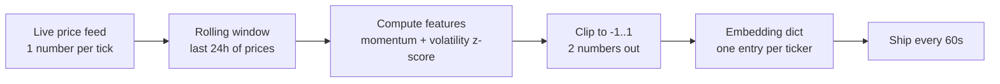

# 02 — Binary Challenges (ETH / CADUSD / NZDUSD / CHFUSD / XAGUSD, 1h)

Five parallel binary‑direction challenges. The simplest and best entry point.

| Property | Value |
|---|---|
| **Tickers** | `ETH`, `CADUSD`, `NZDUSD`, `CHFUSD`, `XAGUSD` |
| **Embedding dim** | `2` (two numbers per sample) |
| **Horizon** | `300` blocks ≈ 1 hour |
| **Weight** (each) | `1.0` |
| **Scorer** | `salience_binary_prediction()` in `model.py` |

---

## 1. What you are predicting

Will the price go **up** over the next 1 hour?

- `y = 1` if the price is higher 300 blocks from now.
- `y = 0` if the price is lower or equal.

---

## 2. What you submit

A **2‑number vector per ticker, every ~60 seconds**. Each number in `[-1, 1]`.

```python
embeddings["ETH"]    = [0.3, -0.1]
embeddings["CADUSD"] = [-0.5, 0.2]
embeddings["NZDUSD"] = [0.0, 0.1]
embeddings["CHFUSD"] = [0.1, 0.1]
embeddings["XAGUSD"] = [-0.2, 0.4]
```

These are **features**, not probabilities. They don't need to sum to anything. The validator feeds them straight into a logistic regression and lets the regression figure out how to combine them.

---

## 3. Where does the embedding come from? (the base source)

The **only raw data you need** is a **time series of recent prices** for the ticker. Nothing else is mandatory.

From that single price stream, you compute **two numbers** that hopefully predict the next 1‑hour direction. Common choices:

| Feature idea | Formula (simple) | What it captures |
|---|---|---|
| Short‑term momentum | `(P_now − P_10min_ago) / P_10min_ago`, clipped to `[-1, 1]` | Recent direction |
| Longer momentum | `(P_now − P_1h_ago) / P_1h_ago` | Hourly trend |
| Volatility regime | z‑score of rolling 1h return std | Calm vs. choppy market |
| Mean reversion | z‑score of `P_now` vs. 4h moving average | Overbought / oversold |

You pick **any two** (or combine several into two), clip to `[-1, 1]`, and ship them as your 2‑number embedding.

That's it. You do not need book data, order flow, news, or anything fancy to start — you can upgrade later.

---

## 4. Simple vocabulary (the only letters you'll see)

| Letter | Meaning | Example |
|---|---|---|
| `T` | How many samples of history the validator has. One sample = 60 s. | `T = 1000` ≈ 17 hours of history |
| `H` | How many miners are in the pool. | `H = 4` miners |
| `D` | Your embedding size. | `D = 2` for binary |
| `AUC` | "How good is a classifier at ranking positives above negatives?" `0.5` = random, `1.0` = perfect. | `AUC = 0.62` means better than random |

That's the whole vocabulary. Everything else is a side effect.

---

## 5. Validation logic — a worked example

Let's invent **four virtual miners** and run them through the real validator code step by step.

### Setup

- Ticker: `ETH`. Horizon: 1 hour (60 samples).
- Validator has collected `T = 1000` samples of ETH history.
- Four miners submitted an embedding at every sample:

| Miner | Strategy | ETH embedding at sample `t` |
|---|---|---|
| **Alice** | Momentum + volatility — a *real* model | `[momentum_t, vol_z_t]` |
| **Bob**   | Random noise | `[rand(-1,1), rand(-1,1)]` |
| **Charlie** | Lazy — never changes | `[0.0, 0.0]` |
| **Dave** | Sybil — **copies Alice's exact numbers** | `[momentum_t, vol_z_t]` (identical to Alice) |

Suppose the first 1000 samples really did happen like this:

- Price went up over the next hour **540 times** → `y = 1`.
- Price went down or stayed flat **460 times** → `y = 0`.

### Step 1 — Build the input matrix

The validator stacks everyone's embeddings into a big array:

```
X has shape (T=1000 samples, H=4 miners, D=2 features)
y has shape (1000,)  →  540 ones, 460 zeros
```

Sanity checks the validator does:
- `T ≥ 500`? Yes. ✓
- Are both `0` and `1` present in `y`? Yes. ✓

If either fails, it just returns `{}` — no salience computed this round.

### Step 2 — Feature selection (who survives?)

The validator asks: *"Can miner j's two numbers, on their own, predict direction better than random?"*

For **each miner independently**:

1. Split `T` in half → first 500 samples = **train**, last 500 samples = **test**.
2. Fit a tiny L2 logistic regression using only that miner's 2 features on the train half.
3. Score the test half. Compute **AUC**.

Hypothetical AUC results:

| Miner | AUC on test half | Pass? |
|---|---:|---|
| **Alice**   | **0.62** | ✓ beats 0.5 → **survives** |
| **Bob**     | 0.49 | ✗ worse than random → **dropped** |
| **Charlie** | 0.50 | ✗ (constants can't classify) → **dropped** |
| **Dave**    | **0.62** | ✓ (identical to Alice) → **survives** |

Rule in code: keep the **top 50 miners with AUC > 0.5**. Here only 2 survive: **Alice and Dave**.

> Intuition: AUC = 0.62 means *"If you pick one random sample where the price went up, and one where it went down, Alice's prediction ranks the up‑one higher **62% of the time**."* That's a real, small edge — plenty to survive.

### Step 3 — Walk‑forward out‑of‑sample predictions

Now for every surviving miner, the validator builds a column of **honest, never‑seen‑before predictions** across the timeline. This is the "walk‑forward" part.

It chops the timeline into segments and, for each segment, *retrains* each miner's tiny logistic using only past data, with a **60‑sample embargo** (an hour gap) before the test window:

```
Segment 1:  TRAIN on samples 0..3999         →  TEST on 4060..8000
Segment 2:  TRAIN on samples 0..7999         →  TEST on 8060..12000
Segment 3:  TRAIN on samples 0..11999        →  TEST on 12060..16000
...
```

With our toy `T = 1000` only one short segment fits, but the principle is the same. For Alice, the validator might produce 940 out‑of‑sample scores like:

```
X_oos[:, Alice]  =  [0.11, -0.35, 0.62, 0.08, ..., -0.22]   # 940 numbers
X_oos[:, Dave ]  =  [0.11, -0.35, 0.62, 0.08, ..., -0.22]   # identical!
```

Why the embargo? The label at sample `t` *looks 60 samples into the future*. If you trained right up to sample `t`, the model could accidentally learn from those future points. The 60‑sample gap prevents that leak.

### Step 4 — The meta‑model (the key step for fairness)

Now the validator fits **one** final logistic regression across **all surviving miners at once**:

```
input  :  X_oos  (the columns from Step 3, one per surviving miner)
target :  y      (did the price actually go up?)
model  :  ElasticNet logistic regression (L1 + L2 penalty)
```

It learns coefficients `β` — one per miner — that say **how much to trust each miner** when mixed together.

Here is the magic. Imagine Alice alone would get `|β| = 0.80`. Because Dave submitted the **identical** column, the L2 penalty forces the coefficient mass to **split evenly between them**:

| Miner | Coefficient `|β|` (solo) | Coefficient `|β|` (with a clone) |
|---|---:|---:|
| Alice | 0.80 | **0.40** |
| Dave (clone) | — | **0.40** |

Two clones do **not** earn twice as much — together they earn what one Alice would have earned. **That is the Sybil defense.**

The L1 part of the penalty drives uninformative miners' coefficients to **exactly zero** (so even if Bob had sneaked through, his `β` would go to 0).

### Step 5 — Turn coefficients into salience

Take absolute values, normalize so they sum to 1:

```
imp["Alice"] = 0.40
imp["Dave"]  = 0.40
# --- sum = 0.80, divide each by 0.80 ---
salience = {"Alice": 0.5, "Dave": 0.5}
```

Bob, Charlie, and every miner who didn't survive feature selection → **0**.

This dict is the binary‑challenge salience for `ETH`. The validator repeats the whole process for each of the 5 tickers, multiplies each dict by `weight = 1.0`, averages them, EMA‑smooths, and pushes on‑chain.

---

## 6. What gets you zero weight

| Mistake | What happens |
|---|---|
| Submit constants (like Charlie) | AUC = 0.5 → dropped at Step 2 |
| Submit random noise (like Bob) | AUC ≈ 0.5 → dropped, or `β` crushed to 0 |
| Copy a top miner (like Dave) | Survive Step 2, but share coefficient → earn **half** of what you thought |
| Miss the ticker | No column at all → `0` |
| Submit only sometimes | Few rows → unstable `β` → small salience |

---

## 7. My take — how to build a good miner

Given that validation logic, here is the **minimum** pipeline that actually works. You can add complexity later.

### What you need

1. **A live price feed for each ticker.** Use the same source the validator uses if possible — spot for ETH, FX for the forex/metal pairs.
2. **A small in‑memory rolling window** of the last ~24 hours of prices (more for a 6 h horizon).
3. **A simple model that outputs two numbers every 60 seconds.**

### The simplest working pipeline



### My opinionated advice

- **Start with two *independent* features, not two versions of the same thing.** E.g. short‑term momentum + volatility regime. Submitting `[p, 1-p]` is the worst thing you can do — it's really only *one* number, and wastes half your capacity.
- **Clip your outputs to `[-1, 1]`.** The validator doesn't care about scale but extreme values make your coefficient unstable.
- **Submit every single cycle.** Even if your model hasn't changed, re‑send the previous value. A missing sample just becomes a gap in the validator's view of you.
- **Don't copy other miners.** The L2 split is automatic — you will literally split your reward with them.
- **Match the label.** When you train your own model, use `y = 1 if price goes up over 300 blocks (1 hour)`. Same label as the validator. No surprises.
- **Forget about being fancy until the basics work.** A clean momentum + volatility setup that runs every 60 s and survives feature selection beats a brilliant model that ships late once a day.

### Why that order?

- Features that *actually* predict 1h direction → you pass **Step 2 feature selection** (survive AUC > 0.5).
- Independent features → your per‑miner logistic in **Step 3** can really use both dimensions.
- No clones → your `β` in **Step 4** is not split with anyone else.
- Continuous submission → your OOS column in **Step 3** is dense, not full of gaps.

---

## 8. Where to look in the code

| What | Where |
|---|---|
| Main scorer | `model.py` → `salience_binary_prediction()` |
| Feature‑selection loop | same function, block labeled `# --- Feature selection` |
| Walk‑forward segment builder | `_build_oos_segments()` in `model.py` |
| Per‑miner base logistic | `_fit_base_logistic()` in `model.py` |
| Meta ElasticNet logistic | `_fit_meta_logistic_en()` in `model.py` |
| Challenge definitions | `config.CHALLENGES` entries with `loss_func == "binary"` |
